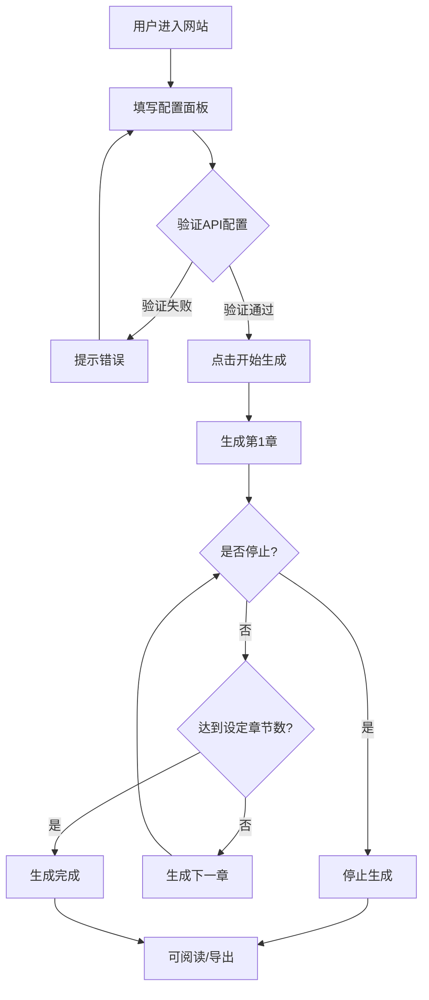

# 墨流小说生成器 - 产品需求文档

## 1. 产品概述

墨流小说生成器是一款基于用户配置的 AI 小说自动生成工具。用户输入小说主题与要求，配置 API 参数后，系统按章节自动、连续地调用大语言模型生成小说内容，直至用户手动停止或达到设定章节数。

目标用户：网文爱好者、创意写作者、AI 内容探索者。

## 2. 核心功能

### 2.1 功能模块

1. **配置面板**：小说主题输入、章节数量设定、每章字数设定、API 参数配置
2. **生成控制台**：开始/停止生成、实时进度展示、生成状态监控
3. **章节阅读器**：侧边栏章节导航、章节内容阅读、章节状态标识
4. **导出中心**：TXT/EPUB/PDF 格式导出

### 2.2 页面详情

| 页面/区域 | 模块名称 | 功能描述 |
|-----------|----------|----------|
| 主界面 | 配置面板 | 输入小说主题、章节数、字数、API配置 |
| 主界面 | 生成控制台 | 控制生成启停，显示进度条和统计信息 |
| 主界面 | 章节侧边栏 | 显示所有章节列表及状态，支持点击跳转 |
| 主界面 | 阅读区域 | 显示当前选中章节的完整内容 |
| 主界面 | 导出工具栏 | 提供多种格式导出按钮 |

## 3. 核心流程

用户进入网站后，首先填写小说主题、设定章节数量（0表示无限）和每章字数，配置 API 地址、Key 和模型名称。点击"开始生成"后，系统依次调用 API 生成各章节。每完成一章，侧边栏更新状态，阅读区自动展示最新内容。用户可随时点击"停止"中断生成。已生成内容支持导出。



## 4. 用户界面设计

### 4.1 设计风格

- **主题**：深色奢华编辑风格，灵感来自高端写作软件和深夜阅读体验
- **主色调**：深墨黑 `#0a0a0f` 背景，暖金 `#d4a574` 强调色，米白 `#f5f0e8` 文字
- **按钮风格**：圆角矩形，悬停时微光效果，主按钮带渐变边框
- **字体**：标题使用 "Noto Serif SC"（思源宋体），正文使用 "LXGW WenKai"（霞鹜文楷），营造文学质感
- **布局**：左侧固定章节栏（280px），右侧主内容区自适应，顶部迷你控制条
- **图标**：使用 Lucide 图标库，线条简洁

### 4.2 页面设计概述

| 区域 | 模块 | UI元素 |
|------|------|--------|
| 顶部栏 | 控制条 | 小说标题显示、开始/停止按钮、导出下拉菜单 |
| 左侧栏 | 章节导航 | 章节列表、状态圆点、滚动条、悬停高亮 |
| 主内容区 | 配置面板 | 大文本输入框、数字输入框、API折叠面板、渐变按钮 |
| 主内容区 | 阅读器 | 章节标题、正文内容、上一章/下一章按钮 |
| 主内容区 | 生成中状态 | 进度条、打字机效果预览、字数统计 |

### 4.3 响应式设计

- **桌面端**：左侧章节栏固定 280px，主内容区自适应剩余宽度
- **平板端**：章节栏可折叠为图标栏，点击展开
- **移动端**：章节栏变为底部抽屉，主内容全屏阅读

### 4.4 动画与交互

- 章节生成时，侧边栏对应项有呼吸灯脉冲动画
- 新内容以打字机效果逐字显示
- 页面切换使用淡入淡出过渡
- 按钮悬停有微缩放和光晕效果
- 进度条使用流光渐变动画

## 5. 数据模型

```typescript
interface NovelConfig {
  theme: string;           // 小说主题/要求
  chapterCount: number;    // 章节数量 (0=无限)
  wordsPerChapter: number; // 每章字数
}

interface ApiConfig {
  baseUrl: string;         // API 基础地址
  apiKey: string;          // API 密钥
  model: string;           // 模型名称
  systemPrompt?: string;   // 系统提示词
}

interface Chapter {
  id: number;              // 章节序号
  title: string;           // 章节标题
  content: string;         // 章节正文
  wordCount: number;       // 实际字数
  status: 'pending' | 'generating' | 'completed' | 'error';
}

interface NovelState {
  config: NovelConfig;
  apiConfig: ApiConfig;
  chapters: Chapter[];
  currentChapterId: number;
  isGenerating: boolean;
  totalWordCount: number;
}
```

## 6. 提示词设计

系统提示词（System Prompt）：

```
你是一位专业的中文网络小说作家，擅长根据用户要求创作引人入胜的长篇小说。

【创作规则】
1. 严格按照用户提供的主题、风格和要求进行创作
2. 每章内容必须连贯，与前后章节保持剧情衔接
3. 章节开头不需要重复小说标题
4. 章节结构：先输出章节标题（格式：第X章：标题），然后换行输出正文
5. 正文要求情节紧凑、描写生动、对话自然
6. 字数必须达到用户要求的字数，只多不少
7. 如果提供了前文内容，请确保新章节与剧情连贯

【输出格式】
第X章：章节标题

（正文内容，段落分明，不少于要求字数）
```

用户提示词模板：

```
【小说要求】
{用户输入的主题和要求}

【本章要求】
- 这是第 {current} 章，总共计划 {total} 章
- 本章要求字数：{words} 字以上
- 每章字数：{words} 字

【前文回顾】（供保持剧情连贯）
{前一章的结尾内容（约500字）}

请创作本章内容，确保剧情连贯、字数充足。
```
