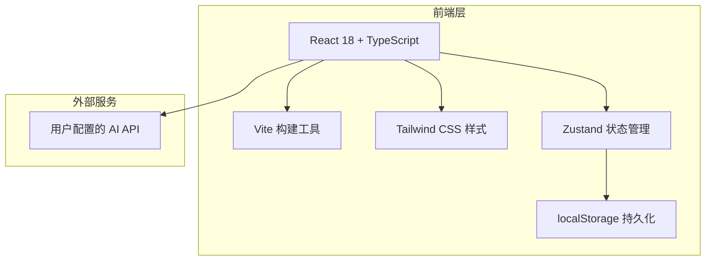

# 墨流小说生成器 - 技术架构文档

## 1. 架构设计



## 2. 技术选型

- **前端框架**：React 18 + TypeScript
- **构建工具**：Vite 5
- **样式方案**：Tailwind CSS 3 + 自定义 CSS 变量
- **状态管理**：Zustand（轻量，适合本应用）
- **本地存储**：localStorage（配置）+ IndexedDB（章节内容）
- **图标库**：Lucide React
- **字体**：Google Fonts - Noto Serif SC + LXGW WenKai
- **导出功能**：原生 Blob API + FileSaver.js

## 3. 路由定义

本项目为单页应用，无路由切换，所有功能在一个页面内完成。

| 视图状态 | 说明 |
|----------|------|
| config | 显示配置面板 |
| generating | 显示生成进度和实时内容 |
| reading | 显示阅读器 |

## 4. API 定义

### 4.1 请求接口

```typescript
interface ChatMessage {
  role: 'system' | 'user' | 'assistant';
  content: string;
}

interface ChatCompletionRequest {
  model: string;
  messages: ChatMessage[];
  stream?: boolean;
  temperature?: number;
  max_tokens?: number;
}

interface ChatCompletionResponse {
  id: string;
  choices: {
    message: ChatMessage;
    finish_reason: string;
  }[];
}
```

### 4.2 调用方式

支持标准 OpenAI 格式 API，用户自行配置：
- `POST {baseUrl}/chat/completions`
- Headers: `Authorization: Bearer {apiKey}`, `Content-Type: application/json`
- 支持流式输出（SSE）和非流式输出

## 5. 数据模型

### 5.1 状态结构

```typescript
interface AppState {
  // 配置
  novelConfig: NovelConfig;
  apiConfig: ApiConfig;
  
  // 章节数据
  chapters: Chapter[];
  currentChapterId: number;
  
  // 生成状态
  isGenerating: boolean;
  isPaused: boolean;
  generationProgress: {
    current: number;
    total: number;
    currentWords: number;
    targetWords: number;
  };
  
  // UI 状态
  view: 'config' | 'generating' | 'reading';
  sidebarCollapsed: boolean;
}
```

### 5.2 持久化策略

- `novelConfig` 和 `apiConfig` → localStorage（自动保存）
- `chapters` 内容 → IndexedDB（大文本存储）
- 生成状态 → 内存（不持久化，刷新后重置）

## 6. 组件架构

```
App
├── Header（顶部控制栏）
├── Sidebar（章节侧边栏）
│   ├── ChapterList
│   └── ChapterItem
└── MainContent（主内容区）
    ├── ConfigPanel（配置面板）
    │   ├── ThemeInput
    │   ├── NumberInputs（章节数/字数）
    │   └── ApiConfigPanel
    ├── GeneratingPanel（生成中面板）
    │   ├── ProgressBar
    │   ├── LivePreview
    │   └── StatsDisplay
    └── ReaderPanel（阅读面板）
        ├── ChapterTitle
        ├── ChapterContent
        └── NavigationButtons
```

## 7. 关键实现细节

### 7.1 流式生成处理

使用 EventSource 或 fetch + ReadableStream 处理 SSE 流式响应，实时将生成的字符追加到当前章节内容中。

### 7.2 字数控制

- 通过 `max_tokens` 参数控制生成长度
- 前端统计中文字符数（不含标点和空格）
- 若生成字数不足，自动发送续写请求

### 7.3 上下文管理

生成新章节时，携带前 2 章的完整内容作为上下文，确保剧情连贯。上下文长度超过模型限制时，进行智能截断（保留最近章节）。

### 7.4 错误处理

- API 调用失败时，当前章节标记为 error，提供重试按钮
- 网络中断时，自动重试 3 次
- 生成过程中可随时停止，已生成内容保留
